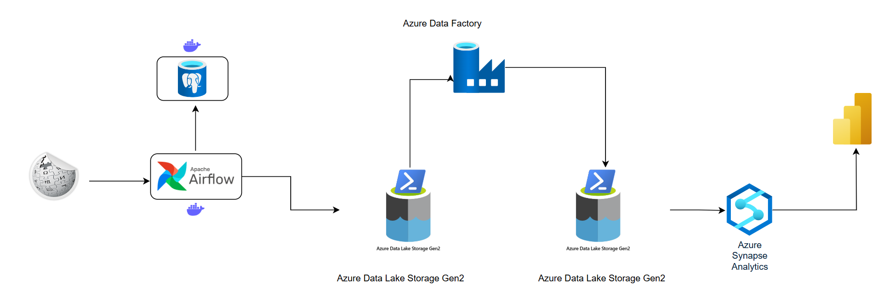

# Football Data Engineering

This Python-based project automates football data crawling from Wikipedia using Apache Airflow, processes the data, and pushes it to Azure Data Lake for further analysis.

---

## Table of Contents
- [System Architecture](#system-architecture)
- [Requirements](#requirements)
- [Getting Started](#getting-started)
- [Running with Docker](#running-with-docker)
- [How It Works](#how-it-works)
- [Project Demo](#project-demo)
- [License](#license)

---

## System Architecture



---

## Requirements

- Python 3.9 or higher
- Docker
- Docker Compose
- PostgreSQL
- Apache Airflow 2.6 or higher

---

## Getting Started

### Clone the repo

```bash
git clone https://github.com/your-username/FootballDataEngineering.git
cd FootballDataEngineering
